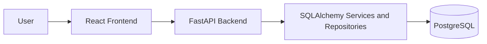

# Bizora

Bizora is a service-business operations platform built for hotels, parlors, salons, and similar businesses. It centralizes customer records, services, visits, expenses, and analytics into a single application with clear ownership boundaries and a responsive user interface.

## What Bizora Does

Bizora helps service-business owners manage daily operations without spreadsheets or fragmented tools. The application lets each authenticated owner:

- create and manage customers
- log visits and attach services to each visit
- record expenses
- review revenue and profit metrics
- inspect customer history
- track top services and payment trends

## Architecture

Bizora follows a clean, layered architecture.



### Frontend

The frontend is a React single-page application powered by Vite and styled with Tailwind CSS. It provides:

- authentication pages
- dashboard analytics
- customer, service, visit, and expense management
- protected routing
- charts and summary cards
- responsive layouts for desktop and mobile

### Backend

The backend is a FastAPI application organized by responsibility:

- API layer for request handling and HTTP responses
- service layer for business rules
- repository layer for database access
- ORM models for database entities
- Pydantic schemas for validation and serialization

### Database

Bizora uses PostgreSQL for persistence. The core tables are:

- `users`
- `customers`
- `services`
- `visits`
- `visit_services`
- `expenses`

## Core Features

### Authentication and Security

- register and login workflows
- JWT-based authentication
- protected frontend routes
- owner-scoped backend queries
- customer profile access restricted to the authenticated owner

### Customer Management

- create customers
- list customers for the logged-in owner
- search customers by name or phone
- open a customer visit history view
- prevent cross-owner record access

### Visit Management

- create visits for existing customers
- create visits with a new customer inline
- attach one or more services to a visit
- store payment method and visit amount
- view visit history and visit details

### Service and Expense Tracking

- create and list services
- create and list expenses
- keep all records scoped to the active owner

### Dashboard Analytics

- today's revenue
- today's customers
- monthly revenue
- monthly expense
- monthly profit
- revenue trend chart
- payment breakdown chart
- customer growth chart
- top services chart

## Technology Stack

### Backend

- FastAPI
- SQLAlchemy
- Alembic
- PostgreSQL
- Pydantic
- python-jose for JWT handling
- psycopg2 for database connectivity

### Frontend

- React 19
- Vite
- React Router
- Axios
- Tailwind CSS
- Recharts
- React Hot Toast

### Infrastructure

- Docker
- Docker Compose

## Repository Structure

```text
Bizora/
	backend/
		app/
			api/
			core/
			dependencies/
			models/
			repositories/
			schemas/
			services/
			utils/
		alembic/
		requirements.txt
		Dockerfile
	frontend/
		src/
			api/
			components/
			layouts/
			pages/
			routes/
		package.json
		Dockerfile
	docker-compose.yml
	README.md
```

## Data Flow

1. A user signs in from the frontend.
2. The frontend stores the JWT in local storage.
3. The Axios client sends the token in the `Authorization` header.
4. The backend validates the token and resolves the authenticated user.
5. Repository queries are filtered by the current owner.
6. API responses only return data belonging to that owner.

## API Overview

### Auth

- `POST /auth/register`
- `POST /auth/login`
- `GET /auth/me`

### Customers

- `POST /customers`
- `GET /customers`
- `GET /customers/search?query=...`
- `GET /customers/{customer_id}/visits`

### Services

- `POST /services`
- `GET /services`

### Visits

- `POST /visits`
- `GET /visits`
- `GET /visits/{visit_id}`

### Expenses

- `POST /expenses`
- `GET /expenses`

### Analytics

- `GET /analytics/dashboard`
- `GET /analytics/top-services`
- `GET /analytics/revenue-trend`
- `GET /analytics/payment-breakdown`
- `GET /analytics/customer-growth`
- `GET /analytics/customers-by-date?date=YYYY-MM-DD`

## Local Development

### Prerequisites

- Docker and Docker Compose
- Node.js 20 for local frontend development
- Python 3.11 for local backend development

### Start with Docker Compose

```bash
docker compose up --build
```

This starts:

- backend on `http://localhost:8000`
- frontend on `http://localhost:5173`
- PostgreSQL on `localhost:5432`

### Backend Only

```bash
cd backend
uvicorn app.main:app --host 0.0.0.0 --port 8000
```

### Frontend Only

```bash
cd frontend
npm install
npm run dev -- --host
```

## Configuration

### Backend Environment Variables

The backend reads configuration from `backend/.env`.

Required values:

- `DATABASE_URL`
- `SECRET_KEY`
- `ALGORITHM`
- `ACCESS_TOKEN_EXPIRE_MINUTES`

### Local Database Credentials

The default Docker Compose database service uses:

- user: `postgres`
- password: `albert@123`
- database: `salon_db`

## Development Notes

- Customer, visit, service, expense, and analytics queries are scoped to the authenticated owner.
- The customer profile page returns a not-found state when a record does not belong to the current owner.
- The dashboard displays summary cards and charts for day-to-day service-business operations.

## Next Improvements

- add pagination to customer and visit tables
- add export support for analytics reports
- add backend unit tests for services and repositories
- add integration tests for owner-scoped API access

## Author

Bizora Team

## License

This project is currently proprietary and all rights are reserved.
